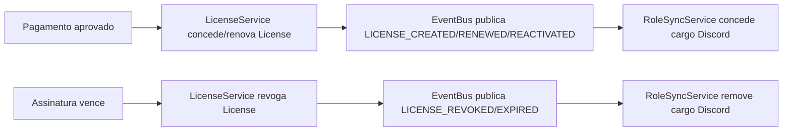

# Integração Backend ↔ Bot — Cargo Discord orientado a evento (Fase 5)

Implementa o pedido da Fase 5: **o bot deixa de ser fonte oficial de
benefícios** para produtos vinculados a `Product`/`License` — ele só reflete
o estado que o backend (`LicenseService`) já decidiu. Complementa
`PRODUCTS_AND_LICENSES.md` (Fase 3, que criou `License`) sem alterar nenhum
model — só a *causalidade* de quem entrega o cargo.

---

## 1. Antes x depois

**Antes (Fase 3):** `SubscriptionService.confirm_payment` chamava
`_deliver_role` (entrega cargo) **e** `_grant_license` (grava `License`) lado
a lado — duas ações independentes disparadas pelo mesmo evento de negócio,
sem relação causal entre si.

**Depois (Fase 5):** para todo `Plan` com `product_id` configurado, o cargo
**só** é entregue como reação à `License` mudar de estado:



`Plan` **sem** `product_id` continua no caminho legado (`_deliver_role`/
`_remove_role` direto em `SubscriptionService`) — comportamento inalterado,
mesma decisão de compatibilidade já tomada na Fase 3.

---

## 2. EventBus interno (`core/event_bus.py`)

Pub/sub em memória, mesmo processo. `EventBus.publish` nunca deixa uma
falha de handler voltar pro publisher (captura e loga) — a mutação de
`License` já foi commitada antes do publish, então um `RoleSyncService`
quebrado nunca impede uma compra de ser processada.

Eventos publicados por `LicenseService` (`core/events.py`), um por transição
de `LicenseEventType`:

| Evento | Quando | Ação esperada |
|---|---|---|
| `LICENSE_CREATED` | primeira concessão | conceder cargo |
| `LICENSE_RENEWED` | renovação (já estava ACTIVE) | conceder cargo (idempotente) |
| `LICENSE_REACTIVATED` | recompra após revogada/expirada | conceder cargo |
| `LICENSE_REVOKED` | cancelamento/reembolso/staff | remover cargo |
| `LICENSE_EXPIRED` | fim de período sem renovação | remover cargo |

`LicenseService(database, event_bus=None)` — `event_bus` é **opcional**
(mesmo princípio de acoplamento opcional de `SubscriptionService.
_notify_renewed`): scripts/testes que só precisam da lógica de posse
continuam funcionando sem montar bot nenhum.

---

## 3. `RoleSyncService` (`services/role_sync_service.py`)

Assina os 5 eventos. Para cada evento: busca o `Player` (→ `discord_id`) e
**todos** os `Plan` de **todas as guilds** que vinculam aquele `product_id` a
um `role_id` (`PlanRepository.list_by_product` — único método do repo que
quebra de propósito a convenção "nunca sem filtro de guild", porque aqui o
objetivo é justamente sincronizar cross-guild). Concede/remove o cargo em
cada uma, e audita (`AuditLogEntry`, categoria `SUBSCRIPTION`) cada ação real
(idempotência: já-tem-cargo/não-tem-cargo não gera auditoria nem chamada à
API do Discord). Falha em uma guild nunca impede as outras (loop com
`try/except` por plano).

---

## 4. Reconciliação periódica (`services/reconciliation_service.py`)

"Nunca confiar apenas em eventos do Discord" — eventos cobrem o caminho
feliz; isto cobre o resto: bot que estava offline quando o evento disparou,
cargo editado manualmente por um staff, membro que saiu e voltou (Discord
zera cargos ao sair).

`ReconciliationService.reconcile_all_guilds()` percorre **todas as guilds**
que o bot está (`bot.guilds`) e, por guild, cada `Plan` com `product_id` +
`role_id`:

1. **Direção 1 — cargo sem License:** para cada membro que tem o cargo
   (`role.members`, cache local), confere `License` ACTIVE; se não tiver,
   remove o cargo (divergência: cargo dado manualmente, ou revogação que
   falhou silenciosamente).
2. **Direção 2 — License sem cargo:** para cada `License` ACTIVE do produto
   (`LicenseRepository.list_active_by_product`), confere se o membro (via
   cache local `guild.get_member`, sem fetch remoto — evita custo alto num
   catálogo grande) tem o cargo; se não, concede.

Cada correção é auditada (`AuditLogEntry`, ação `"Reconciliacao: <motivo>"`)
— reconciliação **nunca corrige em silêncio**. Erro num plano é isolado
(contabilizado em `errors`, não trava os outros planos/guilds).

Rodada automática: `cogs/license_reconciliation.py`
(`LicenseReconciliationCog`), `discord.ext.tasks.loop(minutes=60)`, mesmo
padrão de `SubscriptionRenewalCog` (Cog só chama o serviço, zero lógica de
negócio na Cog).

---

## 5. Canal HTTP autenticado Backend↔Bot (`/internal/*`)

Hoje Backend e Bot rodam no mesmo processo (`api/main.py` embarcado), então
o `EventBus` in-process já cobre o fluxo completo. O endpoint HTTP existe
para o cenário em que esses componentes rodem separados no futuro (ou para
um script externo forçar reconciliação), sem exigir acoplamento Python
direto:

### Autenticação: HMAC-SHA256 (`X-Internal-Signature`)

Reaproveita o mesmo esquema já usado pra validar webhook do Mercado Pago
(`providers/mercadopago.py: validate_webhook`) em vez de inventar um segundo
mecanismo — decisão explícita: "JWT interno ou HMAC", HMAC ganhou por já ser
padrão estabelecido no repo (stateless, sem emissão/expiração de token a
gerenciar, comparação `hmac.compare_digest` resistente a timing attack).

```
X-Internal-Signature: <hex hmac-sha256(INTERNAL_API_SECRET, corpo_cru)>
```

Sem `INTERNAL_API_SECRET` configurado: `503 internal_api_not_configured`
(mesmo padrão de `storage_not_configured`, Fase 4). Assinatura ausente:
`401 missing_signature`. Assinatura errada: `401 invalid_signature`.
Verificação em `api/dependencies.py: verify_internal_signature`.

### `POST /internal/license-events`

Espelha `core.events.LicenseEventPayload` — equivalente HTTP do que o
`EventBus` já despacha in-process. Chama `bot.role_sync_service.
handle_license_event` diretamente (não passa pelo `EventBus` de novo, o
payload já É o evento final). `204` sem corpo.

### `POST /internal/reconcile`

Reconciliação sob demanda (fora do ciclo de 60 min da Cog) — útil pra
staff/backend forçar correção imediata. Retorna `ReconciliationReport`
completo (`guilds_checked`, `roles_granted`, `roles_removed`, `errors`,
detalhe por guild).

---

## 6. Configuração

| Env var | Efeito |
|---|---|
| `INTERNAL_API_SECRET` | segredo HMAC de `/internal/*`. Sem ele, rotas respondem 503. |

---

## 7. Testes

- `tests/test_event_bus.py` — pub/sub isolado: múltiplos handlers, handler
  que falha não derruba os outros nem propaga, evento sem assinante é
  no-op.
- `tests/test_role_sync_service.py` — concede/remove cargo, idempotência
  (já-tem/não-tem), múltiplas guilds simultâneas, isolamento de falha por
  guild, player/plano desconhecido é no-op.
- `tests/test_reconciliation_service.py` — as duas direções de divergência,
  caso sem divergência (não faz nada nem audita), membro fora do cache local
  é pulado (não faz fetch caro), erro por plano isolado e contabilizado,
  agregação `reconcile_all_guilds`.
- `tests/test_license_event_bus_integration.py` — ponta a ponta:
  `LicenseService.grant_or_renew`/`revoke` realmente terminam entregando/
  removendo cargo via `EventBus` real (não só mockado) + `RoleSyncService`
  real. **Pegou um bug de verdade** durante o desenvolvimento: o payload
  publicava `LicenseEventType.value` (`"created"`) em vez do nome do evento
  (`LICENSE_CREATED`), fazendo `RoleSyncService` classificar toda concessão
  como remoção silenciosamente — só o teste de integração ponta a ponta
  expôs isso, os testes unitários de cada lado (mockando a outra ponta)
  passavam igual. Guarda de regressão dedicada também em
  `test_license_service.py` (`test_grant_publishes_event_with_grant_event_name`/
  `test_revoke_publishes_event_with_revoke_event_name`).
- `tests/test_internal_routes.py` — HMAC ausente/errado/válido (case-
  insensitive), 503 sem secret configurado, dispatch correto pros serviços.
