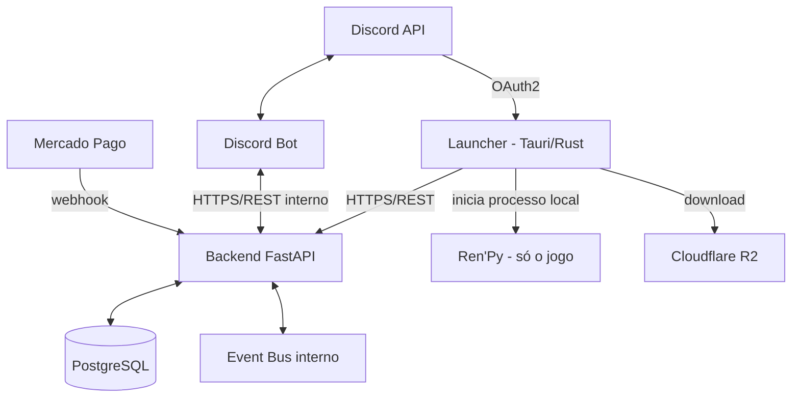
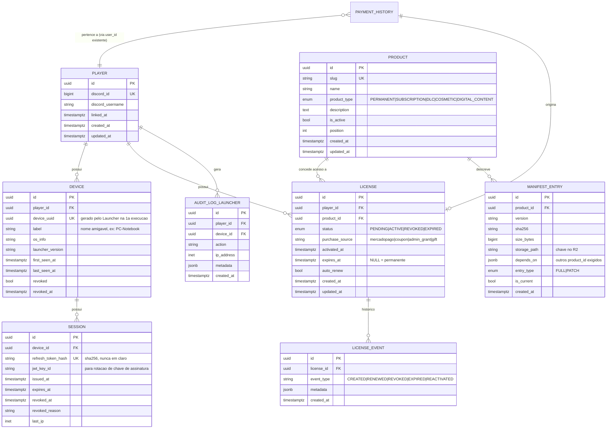
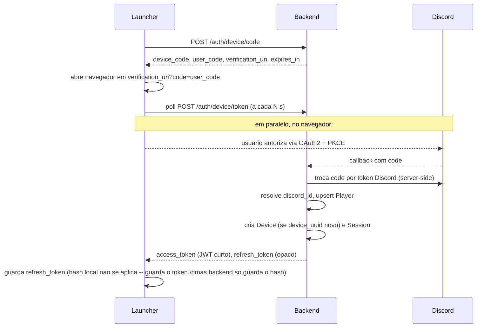
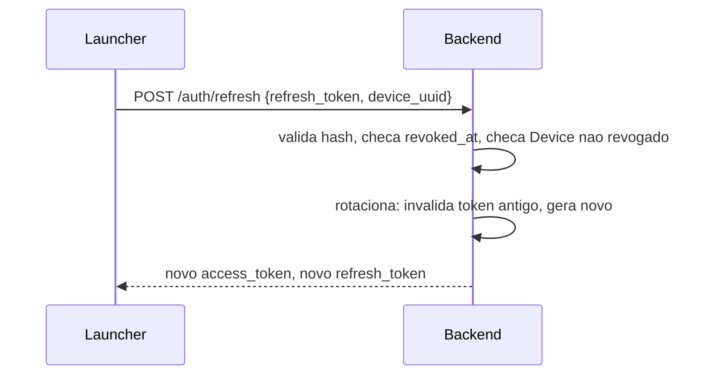
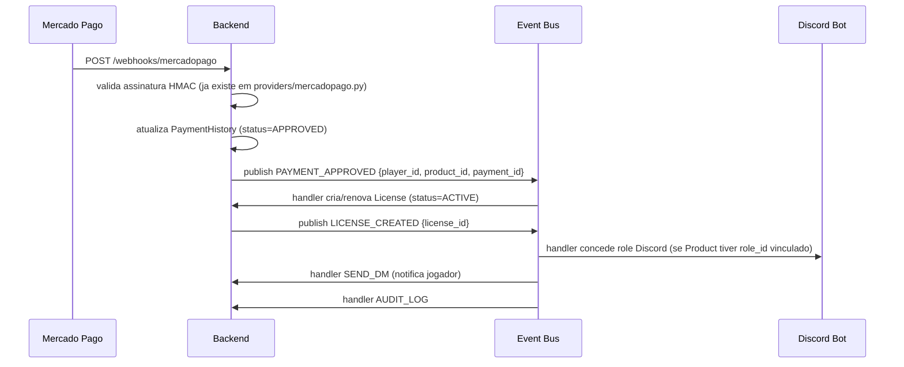
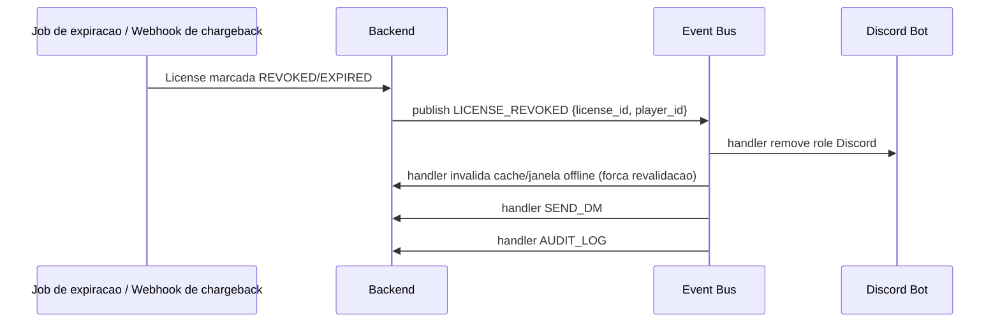
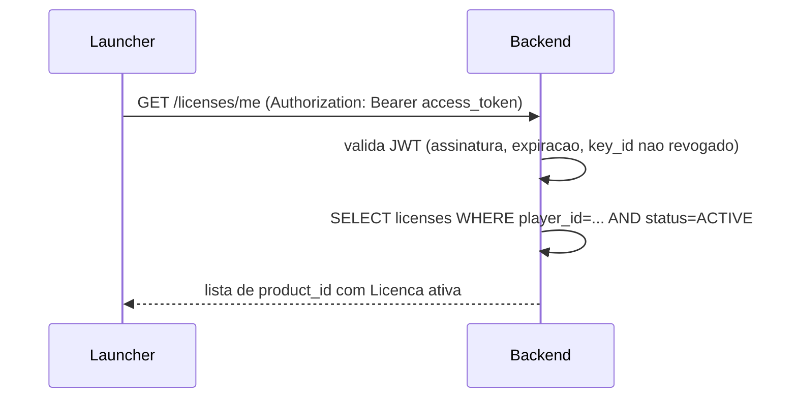
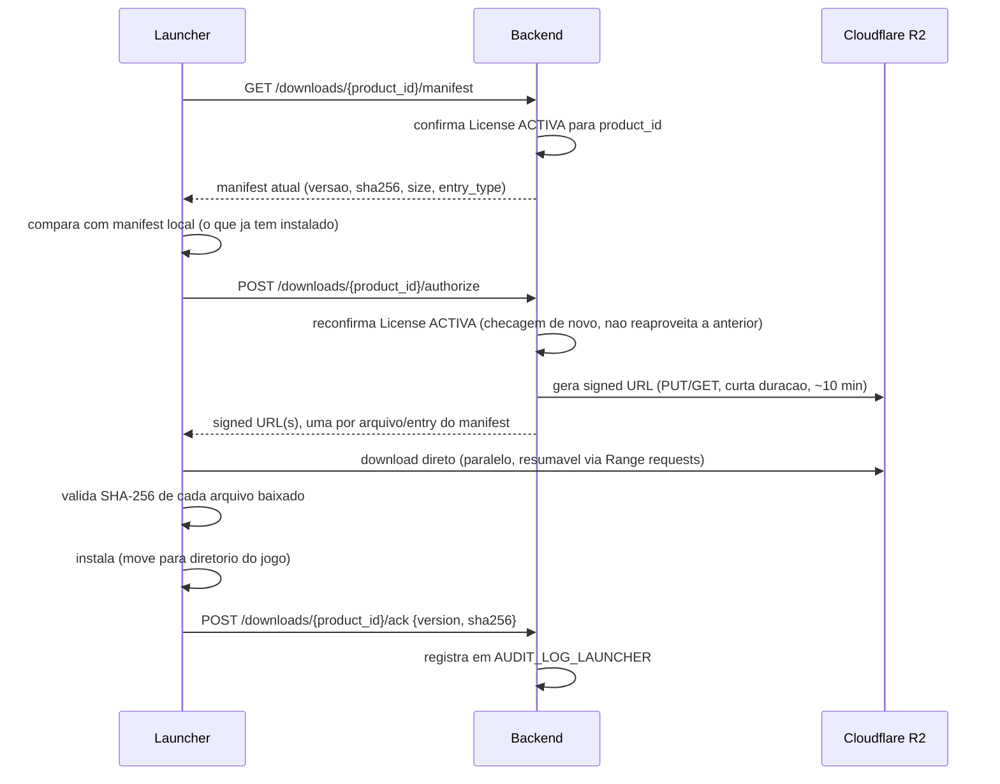
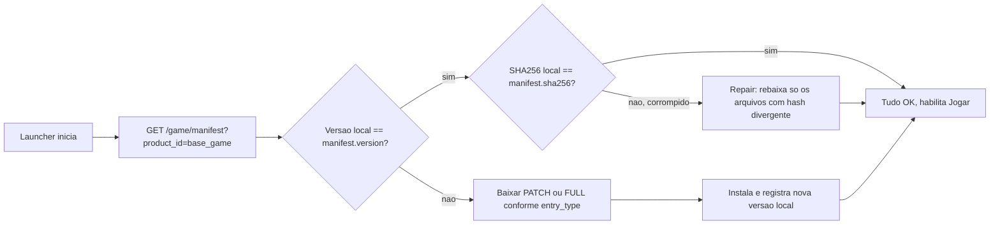

# Arquitetura Limerence Launcher — Backend, Licenciamento e DLC

Status: **aprovado para documentação** (2026-08-05). Implementação só começa após
aprovação explícita deste documento.

Escopo: integração entre o jogo Limerence (Ren'Py), o novo Launcher (Tauri + Rust),
o Backend (FastAPI, já existente neste repo) e o Bot Discord (já existente neste
repo). Convenção de banco segue `docs/database-schema.md`: PK interna UUID
(`gen_random_uuid()`), IDs do Discord em BIGINT.

---

## 1. Visão geral dos componentes



Regras estruturais (não negociáveis):

1. **Backend é a única fonte de verdade.** Todo dado sobre licença/entitlement vem
   de uma consulta ao Postgres no momento da decisão — nunca de cache do cliente
   além da janela offline definida na seção 8.
2. **Ren'Py nunca fala com o backend.** Não faz HTTP, não sabe o que é uma
   licença, não decide se um DLC está liberado. Ele só executa o que já está no
   disco, liberado pelo Launcher antes de abrir o processo.
3. **Nenhum componente conversa direto com outro** fora do Backend, exceto:
   Launcher → Cloudflare R2 (download de bytes já autorizado via URL assinada) e
   Launcher → Discord (só a etapa de OAuth do login).
4. **Discord é só provedor de identidade.** Depois do login, todo o sistema usa
   `player_id` interno. Nenhuma tabela de negócio (produto, licença, device,
   sessão) referencia `discord_id` como chave primária de lógica — só `Player`
   guarda esse vínculo.

---

## 2. Modelo de banco de dados

### 2.1 Diagrama



### 2.2 Notas de design

- **`Player`** é novo. Hoje o bot trata usuário só como `user_id` BIGINT solto
  (ver `subscription.py:37`, `payment.py:35`). `Player` formaliza esse conceito
  como entidade própria com `discord_id` único, e passa a ser o FK usado por
  `License`/`Device`/auditoria — nunca `discord_id` cru.
- **`Product` substitui `Plan`.** `Plan` continua existindo para configuração
  de cargo por guild (`role_id`, `position`, `is_recommended` — conceitos de
  Discord, não de produto). O que muda é que a *posse* de algo vendável deixa
  de ser modelada como `Subscription` e passa a ser `License` referenciando
  `Product`. Ver seção 10 (migração) para como `Plan` e `Product` convivem.
- **`License` substitui `Subscription`/`DlcEntitlement`.** Um único modelo
  cobre assinatura recorrente (`expires_at` + `auto_renew=true`) e produto
  permanente (`expires_at=NULL`), exatamente como pedido no ponto 6 da revisão.
- **Sem fingerprint de hardware.** `Device.device_uuid` é gerado e persistido
  pelo Launcher na primeira execução (arquivo local de config do Launcher, não
  do jogo). Trocar SSD/placa/Windows não invalida o dispositivo, porque o UUID
  não deriva de hardware.
- **`Session.refresh_token_hash`**: nunca se guarda o token em claro — só o
  hash (SHA-256) para comparação. Blacklist é implícita: `revoked_at` não nulo
  = token morto, checado a cada refresh.
- **`MANIFEST_ENTRY.depends_on`**: JSONB com lista de `product_id`, permite
  modelar dependência (ex.: DLC Capítulo 2 exige Base Game instalado).

---

## 3. Fluxo de autenticação (login)

Ren'Py não participa. Fluxo é 100% Launcher ↔ Backend ↔ Discord.



Pontos obrigatórios:

- **PKCE, sem client secret embutido no Launcher.** Client secret em binário
  distribuído é sempre extraível — nunca deve existir no Launcher.
- Backend nunca repassa o token Discord para o Launcher. O Launcher só recebe
  credenciais próprias do backend (`access_token`/`refresh_token`).
- `device_uuid` vai junto no polling de `/auth/device/token`, para o backend já
  vincular `Session` ao `Device` correto na criação.

### 3.1 Sessões seguintes (sem novo login)



Rotação a cada uso detecta roubo: se um refresh_token já usado (e portanto
invalidado) for reapresentado, é sinal de token duplicado/vazado → backend
revoga a `Session` inteira e loga em `AUDIT_LOG_LAUNCHER`.

---

## 4. Fluxo de pagamento → licenciamento (event bus)

O `WebhookService` atual (`services/webhook_service.py`) já recebe webhook do
Mercado Pago e decide pagamento → assinatura → cargo. Isso passa a publicar
eventos em vez de encadear chamadas diretas:



Cadeia de revogação (expiração, chargeback, cancelamento manual):



### 4.1 Implementação do Event Bus

In-process, assíncrono, desacoplado da regra de negócio desde o início:

- Interface mínima: `publish(event_type: str, payload: dict)` e
  `subscribe(event_type: str, handler: Callable)`.
- Handlers registrados na inicialização de cada `service`, não hardcoded no
  publisher — publisher não sabe quem consome.
- Payload sempre serializável (dict/JSON), nunca objetos ORM — é o contrato que
  permite trocar o transporte (in-process → Redis/RabbitMQ/NATS/Kafka) sem
  tocar em regra de negócio, só na camada de transporte do bus.
- Falha de handler não deve derrubar o publisher (isolamento por handler, log
  de erro, sem retry automático nesta fase — fila externa entra quando migrar
  de transporte).

---

## 5. Fluxo de autorização (checagem de entitlement)

Toda rota sensível segue o mesmo contrato:



Nenhuma etapa consulta o Discord em tempo real — a checagem é 100% contra o
Postgres. Reconciliação com Discord (garantir que cargo bate com `License`
ativa) roda como job periódico + listener de evento (`on_member_update`, já
existe padrão em `services/partnership_service.py`), não como parte do fluxo de
autorização do jogo.

---

## 6. Fluxo de download de DLC



Regras:

- Backend **nunca** serve bytes — só assina. R2 escala independente do
  processo do bot/API.
- Autorização é checada de novo no momento de gerar a URL (não reaproveita a
  checagem do manifest), para minimizar janela entre "eu podia" e "eu ainda
  posso".
- Download com falha de hash não instala — Launcher re-tenta o arquivo
  específico, não o pacote inteiro (dá suporte nativo a resumable + repair,
  seção 9).

---

## 7. Fluxo de atualização e reparo



`entry_type=PATCH` é suporte futuro (delta update) — a primeira versão do
manifest só precisa suportar `FULL`, mas o campo já existe no schema (seção 2)
para não exigir migração de banco quando patch incremental for implementado.

---

## 8. Fluxo offline e indisponibilidade

### 8.1 Offline (sem internet)

- A cada validação online bem-sucedida, backend assina (HMAC, chave do
  servidor) um payload `{player_id, licenses: [...], validated_at}` que o
  Launcher guarda localmente.
- Sem internet, Launcher confia nesse payload assinado **por até 30 dias**
  contados de `validated_at`. Dentro da janela: DLC já instalada continua
  acessível, mas nenhum download novo, nenhuma renovação, nenhuma mudança de
  licença é possível offline.
- Depois de 30 dias sem validação bem-sucedida: conteúdo premium bloqueia até
  reconectar. Base game sempre roda offline, sem prazo, porque é distribuído
  completo e não depende de `License`.
- Payload assinado impede que o usuário edite um JSON local pra estender a
  janela — qualquer adulteração invalida a assinatura HMAC e o Launcher trata
  como "nunca validado".

### 8.2 Backend indisponível

Mesmo comportamento do modo offline do ponto de vista do Launcher (ele não
distingue "sem internet" de "backend fora do ar" — só sabe que a chamada
falhou). Diferença operacional: Launcher faz retry com backoff exponencial em
segundo plano, sem bloquear o usuário de jogar dentro da janela de graça.

### 8.3 Discord indisponível

Afeta somente:

1. Login inicial (etapa OAuth não completa).
2. Ajuste de cargo pelo Bot (fila de eventos `LICENSE_CREATED`/`LICENSE_REVOKED`
   pendente de entrega ao Discord).

Não afeta: sessão já autenticada, checagem de `License` (é contra Postgres,
não contra Discord), download de DLC. O Bot deve tratar falha de entrega ao
Discord como reintentável (fila/retry), não como falha da operação de negócio
em si (a `License` já foi criada/revogada no banco independente do Discord
responder).

---

## 9. Estrutura do Launcher (Tauri + Rust)

```
launcher/
├── src-tauri/              # backend Rust do Tauri
│   ├── src/
│   │   ├── main.rs
│   │   ├── auth/            # device code flow, refresh, keychain local
│   │   ├── manifest/        # comparacao de versao, hash
│   │   ├── download/        # paralelo, resumavel (Range requests), fila
│   │   ├── integrity/       # verificacao de assinatura do proprio launcher
│   │   ├── device/          # geracao/persistencia do device_uuid
│   │   ├── game_launcher/   # spawna o processo do Ren'Py
│   │   └── api_client.rs    # cliente HTTP do backend
│   └── Cargo.toml
├── src/                     # frontend (HTML/CSS/TypeScript)
│   ├── views/
│   │   ├── login.ts
│   │   ├── home.ts           # logo, novidades, versao, botao Jogar
│   │   ├── store.ts           # loja / catalogo de produtos
│   │   ├── library.ts         # DLCs instaladas
│   │   ├── settings.ts        # config, devices ativos
│   │   └── diagnostics.ts     # logs
│   └── main.ts
└── package.json
```

Responsabilidades fixadas na seção 1 do acordo do usuário: login, atualização
do jogo, atualização do próprio Launcher, download de DLC, verificação de
integridade, notícias, cache de sessão, reparo de arquivos, inicialização do
Ren'Py. Suporte planejado desde o início (seção 14 do acordo): auto-update do
Launcher, repair, download paralelo/resumável, biblioteca, loja, notícias,
configurações, gerenciamento de dispositivos, logs de diagnóstico.

Auto-update do próprio Launcher usa o mesmo mecanismo de manifest (seção 7),
tratando o Launcher como mais um `Product` do tipo `PERMANENT` com
`product_type` reservado, ou como endpoint dedicado `/launcher/manifest` —
decisão de detalhe a confirmar na fase de contrato de API (seção 11), não
afeta o schema.

---

## 10. Plano de migração da arquitetura atual

Objetivo: reaproveitar o máximo do pipeline existente (`Plan` → cargo,
`PaymentHistory`, `providers/`, `WebhookService`) sem duplicar lógica.

### Fase 0 — Preparação (sem impacto em produção)

- Criar migrations Alembic para `Player`, `Device`, `Session`, `Product`,
  `License`, `LicenseEvent`, `ManifestEntry`, `AuditLogLauncher`.
- Não tocar em `Plan`/`Subscription` ainda — convivem em paralelo.

### Fase 1 — Backfill e Event Bus

- Implementar Event Bus in-process (seção 4.1).
- Job de backfill: para cada `Subscription` ativa hoje, criar `Player`
  (a partir de `user_id`) e `Product` (a partir de `Plan`, 1:1 inicialmente,
  `product_type=SUBSCRIPTION`), e `License` correspondente.
- `WebhookService` passa a publicar eventos (`PAYMENT_APPROVED` etc.) em vez de
  chamar `SubscriptionService` diretamente. Handler do evento ainda escreve em
  `Subscription` **e** `License` (dupla escrita temporária) para não quebrar
  nada que já leia `Subscription`.

### Fase 2 — Cutover de leitura

- Novas rotas (`/licenses`, `/products`) leem só de `License`/`Product`.
- Código legado que lê `Subscription` para decidir cargo é migrado a ler
  `License` — ponto a ponto, com testes de regressão por trecho.
- `Plan` deixa de representar "o que foi comprado" e passa a representar só
  configuração de cargo por guild (nome, cor, emoji, `role_id`) — ligado a
  `Product` via `product_id` opcional, para o Bot saber qual cargo corresponde
  a qual produto.

### Fase 3 — Descontinuação

- Parar a dupla escrita: `WebhookService`/handlers escrevem só em `License`.
- `Subscription`/`SubscriptionHistory`/`SubscriptionRenewal` viram somente
  histórico (não recebem novos registros), mantidos por retenção/auditoria até
  decisão de dropar de vez.

### Fase 4 — Launcher e API de domínio

- Novos routers (`/auth`, `/player`, `/products`, `/licenses`, `/downloads`,
  `/game`, `/news`, `/system`, `/launcher`), cada um com
  router/service/repository/schemas/testes/auditoria própria, seguindo o
  padrão de camadas já usado no repo (`cogs`→`services`→`repositories`→
  `models`, adaptado para `routers`→`services`→`repositories`→`models`).
- Only depois disso o Launcher em Tauri começa a ser implementado contra a API
  já estável.

---

## 11. Pendências para a fase de contrato de API (próximo documento)

Este documento cobre arquitetura, banco e fluxos. Antes de codar, falta
detalhar (documento seguinte, também sem código):

1. Schemas de request/response de cada rota (`/auth/*`, `/licenses/*`, etc).
2. Formato exato do manifest JSON (nomes de campo, versionamento do próprio
   formato de manifest).
3. Estratégia de rotação de chave JWT (quantas chaves ativas simultâneas,
   intervalo de rotação, `key_id` no header).
4. Política de rate limit por rota (limites numéricos).
5. Estrutura de `AuditLogLauncher.metadata` por tipo de ação.

Aguardando aprovação deste documento antes de avançar para o contrato de API.
