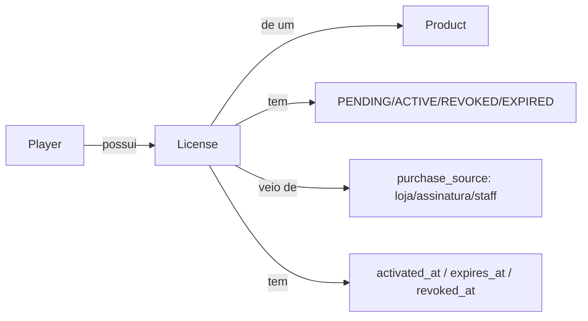
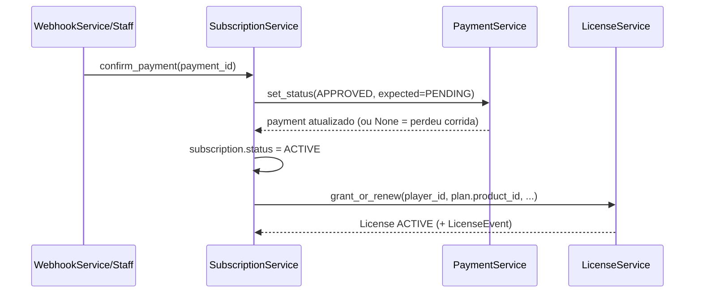

# Sistema de Produtos e Licenças (Fase 3)

Status: **implementado**. Complementa `LIMERENCE_LAUNCHER_ARCHITECTURE.md` (que já
projetava `Product`/`License`/`LicenseEvent` na Fase 0/1) com a camada de serviço,
o vínculo com `Plan`/`Subscription` e a geração/revogação automática de licença.

Escopo: generalizar "o que é vendido" — base game, pacotes de apoio (Patrono,
Mecenas, Fundador), DLC, skin, wallpaper, soundtrack, DLC futuro — sob um único
catálogo (`Product`) e uma única representação de posse (`License`), reutilizando
integralmente `PaymentService`, `SubscriptionService` e `WebhookService` já
existentes. Nenhum sistema paralelo de pagamento/webhook foi criado.

---

## 1. Conceito

- **Product**: catálogo genérico (`bot/database/models/product.py`, já existia). Tipos
  em `ProductType`: `PERMANENT`, `SUBSCRIPTION`, `DLC`, `COSMETIC`, `DIGITAL_CONTENT`.
  Base Game/DLC/Skin/Wallpaper/Soundtrack são linhas de catálogo — não modelos
  separados. Exclusão é sempre soft (`is_active=False` + `deleted_at`).
- **License**: 1 linha por posse de um `Product` por um `Player`
  (`bot/database/models/license.py`, já existia). Única por `(player_id, product_id)`.
  `expires_at=NULL` = produto permanente; preenchido = recorrente (`auto_renew`
  controla renovação automática).
- **LicenseEvent**: histórico imutável de transições de status — mesmo papel que
  `SubscriptionHistory` tem para `Subscription`. É a auditoria do domínio de
  licenciamento (`CREATED`/`RENEWED`/`REVOKED`/`EXPIRED`/`REACTIVATED`).

---

## 2. Camada de serviço (novo nesta fase)

- `bot/services/product_service.py` — `ProductService`: `create`, `update`,
  `soft_delete`, `get`, `get_by_slug`, `list_catalog`.
- `bot/services/license_service.py` — `LicenseService`: `grant_or_renew`, `revoke`,
  `revoke_by_player_product`, `expire_license`, mais consultas (`get`,
  `get_by_player_product`, `list_active_by_player`, `has_active_license`).

Ambos seguem exatamente o padrão de `PaymentService`/`SubscriptionService`: cada
método abre `async with self._database.session()`, instancia o repositório na
hora, sem cache de sessão. `LicenseService` reusa o mesmo padrão de concorrência
de `PaymentService.set_status` — `LicenseRepository.get_by_id_locked` (`SELECT ...
FOR UPDATE`) antes de transicionar status, evitando dupla concessão/revogação em
chamadas concorrentes (ex.: scheduler + clique manual).

`grant_or_renew` é idempotente por design: `License` é única por
`(player_id, product_id)`, então uma recompra/renovação sempre reaproveita a
mesma linha:

| Estado anterior da linha | Evento gerado |
|---|---|
| não existia | `CREATED` |
| `ACTIVE` | `RENEWED` (estende `expires_at`) |
| `REVOKED` / `EXPIRED` / `PENDING` | `REACTIVATED` |

Ambos os serviços são montados em `core/bot.py` (`self.product_service`,
`self.license_service`), junto dos demais serviços de monetização.

---

## 3. Vínculo Plan → Product

`Plan` (o que a guild configura para vender) ganhou uma coluna opcional
`product_id` (FK `products.id`, `ON DELETE SET NULL`) — migração
`c2f5e8a1d4b7_plan_product_link.py`. Plano sem `product_id` continua funcionando
exatamente como antes (só cargo Discord). Plano com `product_id` passa a também
conceder/revogar a `License` correspondente.

---

## 4. Geração e revogação automática (hooks em `SubscriptionService`)

Toda a orquestração de compra/expiração já existia em `SubscriptionService`; a
licença é só mais um efeito colateral do mesmo fluxo, com acoplamento **opcional**
(mesmo padrão já usado por `_notify_renewed`): se `bot.license_service` não
estiver montado, ou o plano não tiver `product_id`, nada muda no comportamento
atual — cargo, DM e log continuam funcionando isolados de licença.

Pontos de chamada em `bot/services/subscription_service.py`:

- **`confirm_payment`** → `_grant_license(subscription, plan, payment)`: resolve/
  cria o `Player` via `PlayerRepository.get_or_create_by_discord_id` (mesmo
  upsert usado no login do Launcher) e chama `LicenseService.grant_or_renew`,
  com `external_reference=str(payment.id)` e `expires_at=subscription.current_period_end`.
- **`expire_subscription`** → `_revoke_license(subscription, plan, reason="Assinatura expirada")`.
- **`cancel_subscription`** → mesmo helper, `reason="Assinatura cancelada"`.
- **`handle_refund_or_chargeback`** → mesmo helper, `reason="Chargeback recebido"` /
  `"Reembolso realizado"`.

Recompensas permanentes (`billing_cycle == ONE_TIME`) nunca são revogadas em
cancelamento/expiração — mesma regra que já existia para o cargo Discord — exceto
em reembolso/chargeback, onde a compra inteira é desfeita (também já era a regra
para o cargo).

`WebhookService` não precisou de nenhuma mudança: ele já delega toda decisão para
`SubscriptionService.confirm_payment`/`reject_payment`/`expire_payment`/
`handle_refund_or_chargeback`, que agora carregam o efeito de licença embutido.

---

## 5. Migrations

- `6ff69141c9a6_sistema_de_licenciamento_launcher.py` (já existia) — cria
  `products`, `licenses`, `license_events` e o resto do domínio Launcher.
- `c2f5e8a1d4b7_plan_product_link.py` (nova) — adiciona `plans.product_id`.
  Idempotente (checa `inspector.get_columns("plans")` antes de alterar), mesmo
  padrão das migrations anteriores por causa do connection pooler do Supabase.

Head atual: `c2f5e8a1d4b7`.

---

## 6. Auditoria

Toda transição de `License` grava um `LicenseEvent` (não `AuditLogEntry`, que é
guild-scoped, nem `AuditLogLauncher`, que é auditoria de autenticação) —
`event_metadata` carrega `purchase_source` na concessão e `executor_id` quando a
revogação foi manual. `list_by_license` (já existente em `LicenseEventRepository`)
serve de base para uma futura tela de histórico de posse por player.

---

## 7. Testes

- `bot/tests/test_license_service.py` + `bot/tests/_fakes_license.py` — cobre
  concessão nova, idempotência por `(player, product)`, renovação sobre licença
  ativa, revogação (idempotente e por `player+product`), reativação pós-revogação
  e expiração.
- `bot/tests/test_product_service.py` + `bot/tests/_fakes_product.py` — cobre
  criação, atualização, soft delete (idempotente), listagem só de ativos e busca
  por slug.

Segue o mesmo padrão de `tests/_fakes_auth.py`: fakes em memória via
`monkeypatch` nos repositórios importados dentro do módulo de serviço — os
models usam tipos Postgres-only (UUID, JSONB, Enum nativo) que não rodam contra
SQLite, então nenhum teste do repo usa banco real.

Hooks dentro de `SubscriptionService` (`_grant_license`/`_revoke_license`) não
ganharam teste de integração dedicado nesta fase — `SubscriptionService` não
tinha suíte de testes própria antes desta mudança (só `PaymentService`/
`LicenseService`/`ProductService` isolados), e simular o fluxo completo exigiria
mocks pesados de `discord.Member`/`discord.Guild` fora do escopo desta fase.
